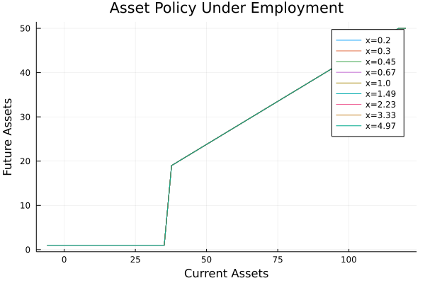
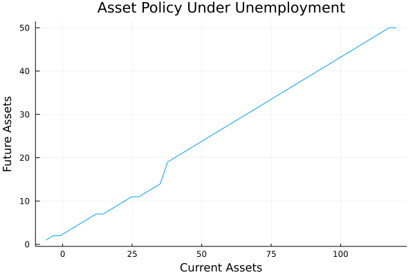
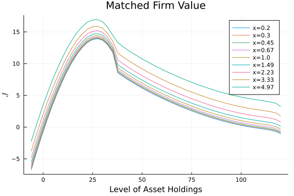
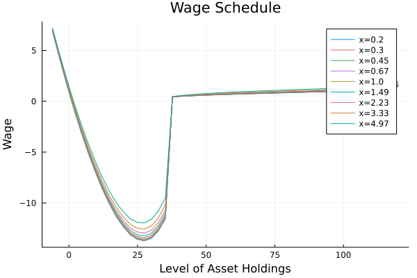
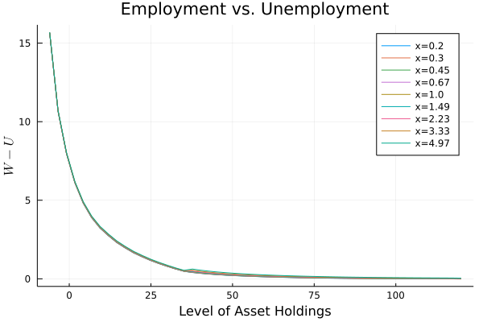
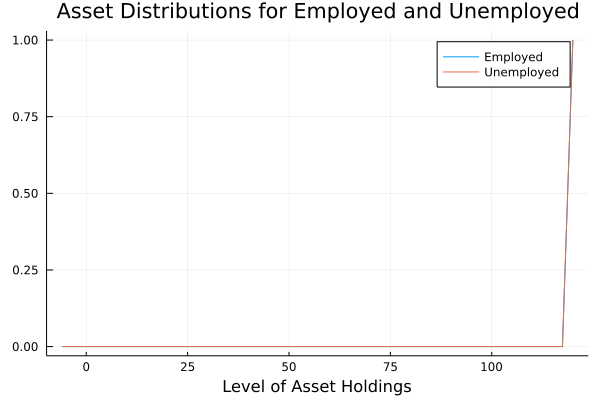
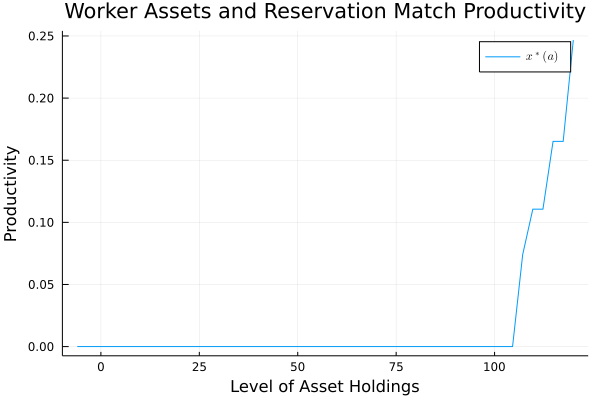

## **Worker Heterogeneity and Endogenous Separations in a Matching Model of Unemployment Fluctuations (AEJ Macro, 2011)**

by Mark Bils, Yongsung Chang, and Sun-Bin Kim

**Abstract:** We model worker heterogeneity in the rents from being employed in a Diamond-Mortensen-Pissarides model of matching and unemployment. 
We show that heterogeneity, reflecting differences in match quality and worker assets, reduces the extent of fluctuations in separations and unemployment. 
We find that the model faces a trade-off -- it cannot produce both realistic dispersion in wage growth across workers and realistic cyclical fluctuations in unemployment. 

## **1. Overview**

In this directory I fully replicate the steady state equilibrium computational algorithm presented in Bils, Chang, and Kim (2011). 
My approach differs from that of the authors' in a few respects, to my knowledge.
Firstly, my routines are programmed in Julia instead of Fortran.
Secondly, my approach is purely discrete -- at no point in the algorithm do I interpolate any of the equilibrium objects, instead I rely on using one- and multi-dimensional grids.
This is due to the fact that interpolation slows the algorithm down substantially compared to pure discretization, which became apparent after I briefly attempted and abandoned this alternative approach.
Lastly, my state space grids are quite coarse, once again in the interest of time -- otherwise testing the results of various tweaks would take too long (and time is money).
There may be other ways in which my approach diverges from the authors', but since I have only briefly skimmed their code I may be ignorant to them. 

As you will see, my results do not match those of the authors. 
After testing and diagnosing every bit of my code multiple times, I've narrowed down the reasons to the following three culprits:
(1) Testing out various grid sizes showed that the algorithm seems to be *very* sensitive to the coarseness of the asset grid. 
The more grid points I use, the closer my results seem to approach the results of the paper -- although I do not have the time to run the full algorithm using a large grid; 
(2) Interpolation may indeed be necessary to avoid the issues seen in my replication figures;
(3) I have caught a few discrepancies between the parameter values mentioned in the paper and those used in the authors' code. 
My code uses the parameter values presented in the paper. 
I also find it puzzling that the authors initialize their steady state equilibrium algorithm with the same endogenous parameter values as the calibrated values shown in the paper -- it seems as though the labor market tightness parameter would likely not converge to 1.

**Note:** To any readers who are also replicating the results of this paper and find mistakes in my code, feel free to either let me know directly or file an issue on GitHub.

## **2. Directory Roadmap**

The following is a description of all files in this directory:

- `steady_state_equilibrium.jl` -- contains a module with all necessary routines to compute the steady state equilibrium of the model presented in Bils, Chang, and Kim (2011) as it is defined in the paper.

- `ss_equilibrium_interpolated.jl` -- contains value function iteration functions equivalent to those in `steady_state_equilibrium.jl`, but with all value functions being interpolated at each iteration of the algorithm. 
This approach is considerably slower than the purely discrete approach in `steady_state_equilibrium.jl`, so I have given up on developing it further. 

- `generate_figures.jl` -- solves for the steady state equilibrium of the model using the routines in `steady_state_equilibrium.jl`, saves all relevant equilibrium objects in the `\data` subfolder, and recreates the figures in the paper as `.png` files stored in the `\figures` subfolder. 

## **3. Function Descriptions** 

The following list provides a brief overview of each function in `steady_state_equilibrium.jl` that are necessary to replicate the steady state equilibrium results of the paper: 

- `ModelParams` -- This structure stores all necessary model parameters, including grids and endogenous parameters such as the labor market tightness parameter.
For those parameters that are not specified by the user, it assigns the values used in the paper for the benchmark economy as described in Section II.A and presented in the Benchmark column of Table 1.  
It does not store value, policy, and wage functions. 

- `utility` -- This function represents the workers' Bernoulli utility function.
It is a simple mapping of model parameters and a given level of consumption to an instantaneous utility level. 
The consumption input can be either a real value or a vector of real values, and the output will have the corresponding format. 

- `TauchenApprox` -- This function estimates the autoregressive log process of the match productivity shock as a finite-state Markov chain, and returns the corresponding transition matrix, stationary distribution, and transformed state vector. 

- `HHBellmanMap` -- This function applies one iteration of the Bellman map.
It takes guesses for the values of the employed and unemployed workers' value functions as inputs, along with model parameters and a wage function, and outputs the next iteration of the workers' two value functions and corresponding asset policy functions.
Using a nested for loop, this function runs through the state space, which is the Cartesian product of the asset and match productivity grids, and for each possible point in the state space it finds the maximized value of the Bellman map with respect to the next period's asset holdings on the asset grid.
The maximum of the Bellman map is saved as an entry in the next iteration of the value function, and the maximizing point of the asset grid is saved as an entry in the asset policy function.
All objects in this function are discretized -- at no point do I interpolate either the value functions or the asset policy functions.

- `SolveHHBellman` -- Given initial guesses for the value functions and a given wage function, this function iteratively applies the Bellman mapping until convergence in the value of unemployment is reached. 
This corresponds to step 3.b of the steady state algorithm presented in Section A of the Annex.
It takes the same inputs as `HHBellmanMap`, along with a convergence criterium, and then applies `HHBellmanMap` until convergence is achieved. 
The returned value and policy functions are the approximations of the true value and policy functions given the inputted guess for the wage function. 

- `UpdateWage` -- Using guesses for the workers' value and policy functions, and given a guess for the wage function, this function solves for the entrepreneurs' value of a worker match by solving the Nash bargaining problem presented in Eq. (5) using the Nash bargaining condition shown in the definition of the equilibrium in Section I.E. 
After the entrepeneurs' value function is obtained, the wage function is updated, once again by the Nash bargaining problem presented in Eq. (5). 
All of the above corresponds to step 3.c of the steady state algorithm presented in Section A of the Annex.  

- `InitializeFunctions` -- Given the model parameters, this function returns initial guesses for the workers' value functions and the wage function.
The workers' employment and unemployment value functions are guessed to be the present discounted value of the utility gained from remaining at any given state space node in perpetuity. 

- `SolveWage` -- This function applies steps 1-4 of the steady state algorithm presented in Section A of the Annex.
The only two inputs are the model parameters and a convergence criterium for the wage function.
First `InitializeFunctions` is used to generate initial guesses for the workers' vaule functions and the wage schedule.
Then a while loop that iteratively update the wage schedule is initiated. 
Each step of the while loop takes the previous guesses for the workers' value functions and the wage schedule, updates the workers' value and policy functions given the wage schedule using `SolveHHBellman`, then applies `UpdateWage` to update the wage schedule and the entrepreneurs' value of a worker match, and lastly checks whether convergence is achieved and if not then updates the wage schedule once more as instructed by step 3.d of the steady state algorithm presented in Section A of the Annex.
Once convergence is achieved, `SolveHHBellman` and `UpdateWage` are applied one last time, and all equilibrium objects are returned.

- `ReservationProductivity` -- Given approximations for the workers' value functions, this function computes the reservation match productivity mapping.
In other words, for each asset holding value in the asset grid, it shows the value of the match productivity above which a worker is willing to continue employment.
This is done by comparing the value of employment to the value of unemployment at each node of the state space, and then going through the match productivity grid for each given value of asset holdings to see between which nodes the value of employment surpasses that of unemployment. 
The returned object is a vector of the same length as the asset grid, where each entry is *value* of the reservation productivity factor rather than a position in the match productivity grid (each value will naturally be either 0 or a midpoint between two productivity grid nodes). 

- `InitializeTransitionMatrices` -- This function computes the necessary components of the transition matrices for the measure of employed and unemployed workers, given the model parameters, workers' policy functions, and the reservation productivity function. 
Here I will each of the created objects one-by-one.
Firstly, `H_ee` contains the probabilities corresponding to the decisions of employed workers, given that they remain employed in the next period.
Therefore, for any given mapping from an (a,x) node to an (a',x') node, the corrsponding entry in `H_ee` is equal to the probability of the given x' only if a' corresponding to the policy mapping from (a,x) and x' is greater than the reservation match productivity, and zero otherwise.
`H_eu` contains the probabilities corresponding to the decision of employed workers, given that they become unemployed in the next period.
This implies that for any given mapping from an (a,x) node to an (a',x') node, the corresponding entry in `H_eu` is equal to the probability of the given x' only if a' corresponding to the policy mapping from (a,x) and x' is less than the reservation match productivity, and zero otherwise.
`H_ue` contains the probabilities corresponding to the decision of unemployed workers, given that they become employed in the next period.
This implies that for any given mapping from an (a,x) node to an (a',x') node, the corrsponding entry in `H_ue` is equal to the probability of the given x', only if a' corresponding to the unemployed worker's policy mapping from (a,x) and x' is equal to the unconditional expected value of productivity, and zero otherwise.
Lastly, `H_uu` contains the probabilities corresponding to the decision of unemployed workers, given that they remain unemployed in the next period.
This implies that for any given mapping from an (a,x) node to an (a',x') node, the corrsponding entry in `H_uu` is equal to the probability of the given x' only if a' corresponding to the unemployed worker's policy mapping from (a,x).
The returned objects are `H_ee`, `H_eu`, `H_ue`, and `H_uu`. 

- `FindStationaryMeasures` -- This function constructs the transition matrices of the employed and unemployed workers, and then keeps stepping forward in time using these matrices to obtain stationary distribution for employed and unempoyed workers, respectively.
Given an initial distributions for employed and unemployed workers in the form of vectors, the next period's distribution of employed workers consists of the employed distribution multiplied by the `H_ee` matrix, plus the distribution of unemployed workers multiplied by the `H_ue` matrix and scaled by the probability of matching with an open vacancy.
Analogously, the next period's distribution of unemployed workers consists of the employed distribution multiplied by the `H_eu` matrix, plus the distribution of unemployed workers multiplied by the `H_uu` matrix and scaled by the probability of remaining unemployed (one minus the probability of matching with an open vacancy).
Both of the generated vectors described above are then normalized relative to the sum of their components to guarantee that they represent distributions (components sum to 1).
The above process is repeated until convergence, and separate approximations of the stationary distributions for the employed and unemployed workers are obtained.
This procedure corresponds to the first part of step 4 of the steady state algorithm presented in Section A of the Annex.

- `AdjustTheta` -- Given model parameters, an approximation for the entrepreneurs' value of a worker match, and the stationary distribution of unemployed worekrs, this function adjusts the labor market tightness parameter according to the second part of step 4 of the steady state algorithm presented in Section A of the Annex.
The output of the function is simply an updated value of the market tightness parameter. 

- `SolveEquilibrium` -- This function applies the full steady state algorithm presented in Section A of the Annex.
It only requires an initial set of model parameters as an input, and returns all equilibrium objects. 

## **4. Replication** 

The following figures are generated by running a single iteration of the full steady state equilibrium algorithm using the calibrated parameter values presented in the paper.
On my personal computer (which has relatively weak specs) a single iteration of the algorithm takes only a few minutes to run, while running the algorithm until convergence using arbitrary initial parameter values seems to take up to a day. 

